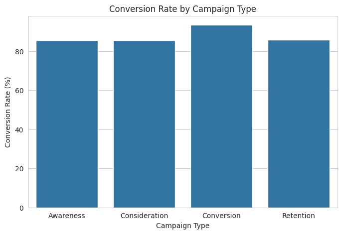
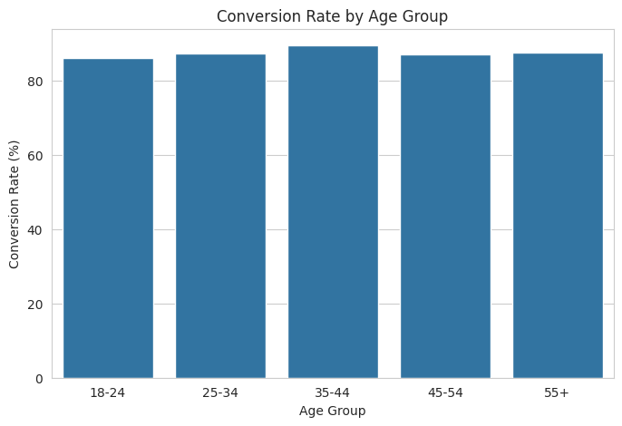
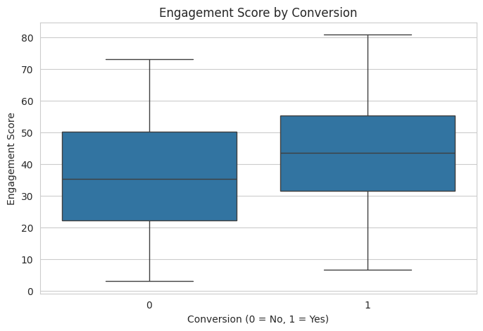
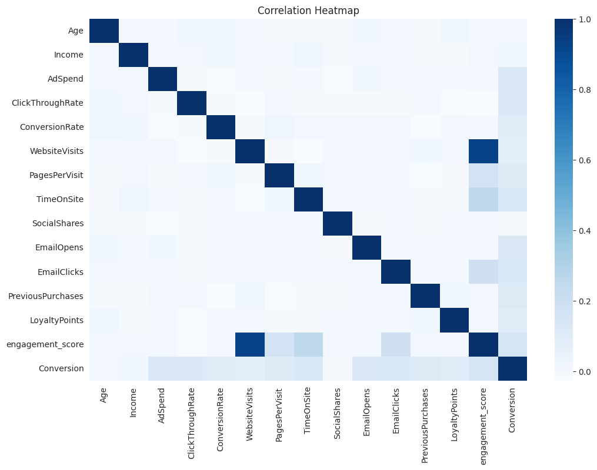
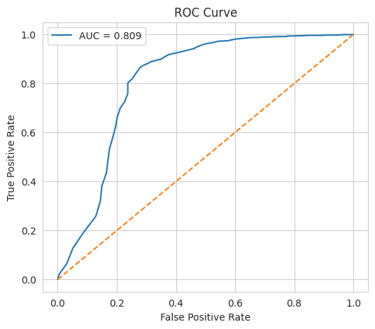
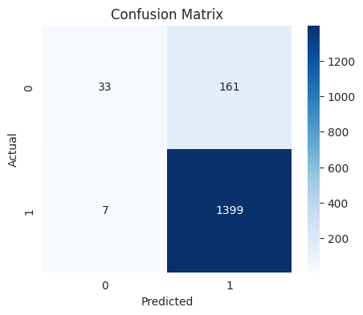
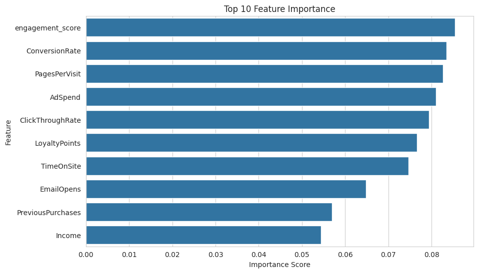
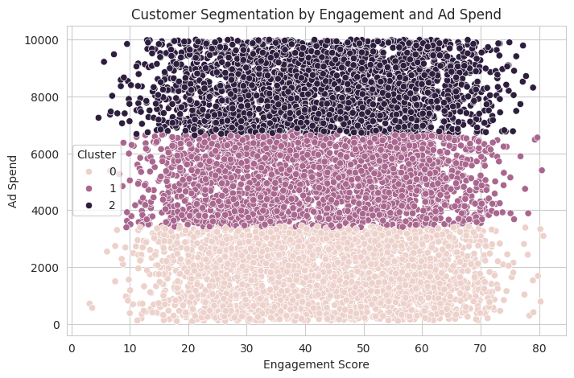

# Digital Marketing Campaign Optimization & Customer Conversion Prediction


---

# Project Overview

Digital marketing campaigns often run across multiple channels and objectives at the same time. While overall campaign performance may appear strong, understanding which campaign strategy truly drives conversion requires deeper analysis.

Performance can vary based on campaign objective, acquisition channel, customer age, engagement behavior, and budget allocation.

This project was created to evaluate digital marketing performance and predict customer conversion using a combination of SQL, Python, machine learning, and customer segmentation.

The goal was to answer an important business question:

> **Which campaigns and customer segments drive the highest conversion, and how can marketing teams use data to improve future campaign performance?**

This project combines descriptive analytics and predictive analytics into one workflow:

**Business Problem → SQL Analysis → Exploratory Analysis → Machine Learning → Customer Segmentation → Business Recommendation**

---

# Business Problem

Marketing teams commonly invest across:

- Email
- SEO
- PPC
- Referral
- Social Media

while also running multiple campaign objectives:

- Awareness
- Consideration
- Conversion
- Retention

The challenge is that not every campaign produces the same results.

Some channels convert more effectively, certain customer segments respond more strongly, and engagement behavior can significantly influence outcomes.

Without clear analysis, budget decisions can become inefficient.

This project focuses on answering:

- Which campaign type performs best?
- Which customer segment converts more effectively?
- How strongly does engagement impact conversion?
- Which variables are the strongest predictors?
- Which customer groups deserve stronger budget allocation?

---

# Dataset

This project uses the **Digital Marketing Campaign Dataset** from Kaggle.

The dataset contains **8,000 customer records** and **20 columns** that combine customer profile, campaign performance, engagement metrics, and conversion outcomes.

### Customer profile

- CustomerID
- Age
- Gender
- Income

### Campaign information

- CampaignChannel
- CampaignType
- AdvertisingPlatform
- AdvertisingTool
- AdSpend

### Engagement metrics

- WebsiteVisits
- PagesPerVisit
- TimeOnSite
- SocialShares
- EmailOpens
- EmailClicks

### Customer history

- PreviousPurchases
- LoyaltyPoints

### Target

- Conversion

A data validation step confirmed:

✅ no missing values  
✅ no duplicate rows

This made the dataset ready for analysis and modeling.

---

# Tools & Technologies

| Tool | Purpose |
|---|---|
| Google BigQuery | SQL analysis |
| Python | analysis |
| Google Colab | notebook |
| Pandas | transformation |
| NumPy | calculations |
| Matplotlib | charts |
| Seaborn | visualization |
| Scikit-learn | ML pipeline |
| Random Forest | prediction |
| K-Means | segmentation |

---

# SQL Analysis

The first stage was completed in Google BigQuery.

The purpose was to validate data quality and answer core business questions before modeling.

Queries covered:

- campaign performance
- channel analysis
- age segmentation
- engagement vs conversion
- loyalty impact
- income segmentation
- top-performing combinations

This phase helped identify strong performance patterns and provided a solid business baseline before moving into Python.

---

# Exploratory Data Analysis

After SQL analysis, the dataset was explored further in Python.

Two additional analytical features were created:

### Age Group

Customers were segmented into:

- 18–24
- 25–34
- 35–44
- 45–54
- 55+

### Engagement Score

A combined score was created using:

- WebsiteVisits
- PagesPerVisit
- TimeOnSite
- EmailClicks

This made customer interaction easier to evaluate in one metric.

---

## Conversion by Campaign Type

Campaign objective showed a meaningful difference in performance.

Among all campaign types, **Conversion campaigns achieved the highest average conversion rate at 93.36%**.

Other campaign types performed lower:

- Awareness → 85.56%
- Consideration → 85.56%
- Retention → 85.82%

Quantitatively, conversion campaigns outperformed other objectives by roughly **7–8 percentage points**.

Qualitatively, this suggests that campaigns optimized directly for customer action were significantly more effective than awareness-focused campaigns.



---

## Conversion by Age Group

Customer conversion remained relatively stable across age groups, but one segment stood out.

The **35–44 age group recorded the highest conversion rate at 89.59%**.

The lowest-performing segment was **18–24 at 86.31%**.

This creates a gap of approximately **3.3 percentage points**.

From a business perspective, the 35–44 segment appears to respond more effectively to digital marketing activity and represents a valuable audience for campaign targeting.



---

## Engagement Score by Conversion

Customer engagement showed one of the clearest differences.

Converted customers consistently demonstrated stronger behavior.

| Metric | Converted | Not Converted |
|---|---:|---:|
| Website Visits | 25.18 | 21.73 |
| Pages per Visit | 5.65 | 4.84 |
| Time on Site | 7.93 | 6.27 |
| Email Clicks | 4.61 | 3.48 |

Converted customers visited the website around **16% more often** and interacted more deeply.

Qualitatively, this indicates that stronger customer interaction is closely tied to conversion behavior.



---

## Correlation Analysis

Correlation analysis confirmed that behavioral metrics had stronger relationships with conversion than demographic variables.

The strongest relationships appeared between:

- engagement_score
- WebsiteVisits
- PagesPerVisit
- TimeOnSite

Demographic variables such as age and income showed weaker relationships.

This suggests that customer behavior is more predictive than profile information alone.



---

# Predictive Modeling

A **Random Forest Classifier** was built to predict customer conversion.

The dataset was split:

- 80% training
- 20% testing

Random Forest was chosen because it performs well with structured business data and also allows feature importance analysis.

Results:

| Metric | Result |
|---|---:|
| Accuracy | 89.5% |
| ROC AUC | 0.809 |

The model correctly classified nearly **9 out of 10 outcomes**.

ROC-AUC above **0.80** also indicates strong separation between converted and non-converted customers.

Business value:

- lead prioritization
- campaign targeting
- remarketing support
- customer scoring

---

## ROC Curve

The ROC curve confirms strong predictive performance.



---

## Confusion Matrix

The confusion matrix shows the model classified most conversion outcomes correctly.



---

# Feature Importance

Feature importance identified the strongest conversion drivers.

| Feature | Importance |
|---|---:|
| engagement_score | 8.54% |
| ConversionRate | 8.35% |
| PagesPerVisit | 8.27% |
| AdSpend | 8.10% |
| ClickThroughRate | 7.94% |

The top features were clustered closely between **7.9%–8.5%**, showing that multiple engagement and campaign variables contribute meaningfully.

Qualitatively, engagement remains the most actionable business driver.



---

# Customer Segmentation

K-Means clustering grouped customers into three segments based on engagement and advertising spend.

| Cluster | Avg Ad Spend | Avg Conversion |
|---|---:|---:|
| 0 | 1,783 | 82% |
| 1 | 5,067 | 88% |
| 2 | 8,306 | 92% |

Cluster 2 spent around **4.6x more than Cluster 0** while also generating the strongest conversion.

Cluster 1 remained balanced between spend and performance.

This indicates a strong relationship between investment level and campaign output.



---

# Key Insights

Several important findings emerged.

**Conversion-focused campaigns consistently delivered the strongest results**, outperforming other objectives by around **7–8 percentage points**.

**Customers aged 35–44 converted the most**, making them a high-value segment.

**Customer engagement was the strongest predictor**, especially website interaction and email activity.

**The predictive model performed strongly** with **89.5% accuracy** and **0.809 ROC-AUC**.

**Higher-spend customer segments delivered stronger conversion outcomes**, supporting smarter budget prioritization.

---

# Business Recommendations

Based on the analysis:

### Prioritize conversion-focused campaigns

These delivered the strongest performance.

### Improve engagement touchpoints

Focus on:

- landing page experience
- session depth
- email interaction

### Prioritize stronger-performing customer groups

Especially:

- age 35–44
- high engagement segments

### Use predictive scoring

Support targeting and campaign prioritization.

### Allocate budget strategically

Scale investment toward stronger-performing customer segments.

---

# Project Structure

```bash
digital-marketing-campaign-optimization/
│
├── queries/
├── images/
├── digital_marketing_campaign_dataset.csv
├── customer_conversion_prediction_and_campaign_analytics.ipynb
└── README.md
```

---

# Author

**Kenneth Christian Nathanael**

Portfolio:  
https://kenchristn.com

GitHub:  
https://github.com/kenchristn
